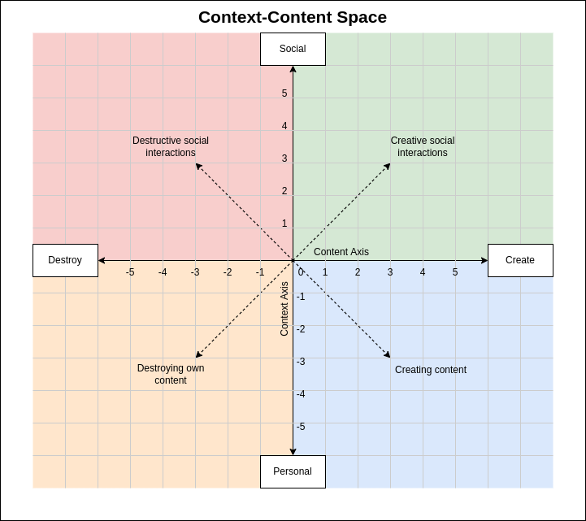
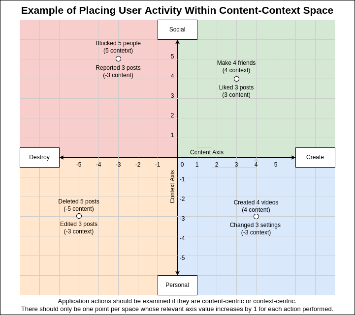

# Egregore Kit
-----------------------

The Egregore Kit is a series of mathematical tools and algorithms to help detect and measure the nature of an [egregore zoo](https://en.wikipedia.org/wiki/Egregore).

## Install

[](https://stackblitz.com/github/hypercrowd/typescript-server-template)

`npm i -S https://github.com/PsySecGroup/egregore-kit.git` or `yarn add https://github.com/PsySecGroup/egregore-kit.git`

## Introduction

The Egregore Kit operates from the assumption that egregores are [state of matter](https://en.wikipedia.org/wiki/State_of_matter) shifts for matter made up of collectively shared contexts.  We create a space for each user, gather the HTTP REST requests of a user, and add those requests to the space.  This will establish shape, temperature (the difference between social from personal activity), and pressure (the difference between create and delete activity). The kit maps each user action that can be done in an application to a context axis and to a context axis:



### Axioms:

* Positive numbers on the context axis represent actions that target social context.
* Negative numbers on the context axis represent actions that target personal context.
* Positive numbers on the content axis represent actions that create content.
* Negative numbers on the content axis represent actions that destroy content.
* The content axis and the context axis are orthogonal to each other.
* Each application has REST endpoints the user uses HTTP requests to perform actions to the application.
* The REST endpoints should follow as many of the [HTTP 1.1 Request Method Standards](https://datatracker.ietf.org/doc/html/rfc7231#section-4) as possible, especially:
  * [Idempotency](https://datatracker.ietf.org/doc/html/rfc7231#section-4.2.2)
  * [Method Definitions](https://datatracker.ietf.org/doc/html/rfc7231#section-4.3)
    * Each **GET** methods is a positive number for either the content or the context axis.
    * Each **POST** methods is a positive number for either the content or the context axis.
    * Each **PUT** methods is a negative number for either the content or the context axis.
    * Each **DELETE** methods is a negative number for either the content or the context axis.
* Four vectors can be created from each point with the following properties:
  * _Context magnitude_, which is the position of the point on the context axis.
  * _Content magnitude_, which is the position of the point on the content axis.
  * _Type*, which is the kind of vector being represented (_socialCreate, personalCreate, personalDestroy, socialDestroy_)
* There should only be one point per orthogonal quadrant whose relevent axes position increases by 1 for each action prformed:



### Usage

```ts
import { HttpRequest, Space } from 'egregore-kit'

// Define what HTTP REST endpoints represent what quadrants in the Context-Content Space.
// Wildcards can be used for complex URIs
const space = new Space({
    social: [
      'POST /like/*',
      'POST /favorite/*',
      'POST /friendRequest/*',
      'POST /post/*/comment',
      'POST /search/*',
      'POST /joinGroup/*',
      'POST /report',
      'POST /block/*',
      'POST /unfriend/*'
    ],
    personal: [
      'POST /video',
      'POST /post',
      'POST /settings',
      'POST /changePassword',
    ],
    create: [
      'POST /video',
      'POST /post',
      'POST /post/*/comment',
      'POST /like/*',
      'POST /favorite/*',
      'POST /friendRequest/*',
      'POST /post/*/comment',
      'POST /search/*',
      'POST /joinGroup/*'
    ],
    destroy: [
      'DELETE /video/*',
      'POST /changePassword',
      'POST /settings',
      'DELETE /post/*',
      'DELETE /comment/*',
      'PUT /video/*',
      'PUT /post/*',
      'PUT /comment/*',
      'POST /report',
      'POST /block/*',
      'POST /unfriend/*'
    ]
  })

// Populate the space with HTTP Requests from methods, endpoints, and timestamps extracted from an Nginx or Apache log
space.addRequests([
  new HttpRequest('POST', '/like/1', 1664661095644),
  new HttpRequest('POST', '/video', 1664661096644),
  new HttpRequest('POST', '/friendRequest/3', 1664661097644),
  new HttpRequest('POST', '/block/4', 1664661097644)
])

// Get an array of where the HTTP Requests distributed across the Context-Context space
const points = space.getPoints()
/*
[
  { type: 0, content: 0, context: 1, time: 1 },
  { type: 0, content: 0, context: 1, time: 3 },
  { type: 0, content: 0, context: 1, time: 4 },
  { type: 1, content: 0, context: -1, time: 2 },
  { type: 2, content: 1, context: 0, time: 1 },
  { type: 2, content: 1, context: 0, time: 2 },
  { type: 2, content: 1, context: 0, time: 3 },
  { type: 3, content: -1, context: 0, time: 4 }
]
*/

// Sum together each content and context position into one vector per quadrant, calculate the angles between each point, and calculate the temperature and pressure of the shape based on how many users generated all of the requests.  (In this example, 3 users, which is seen as the first parameter)
const vectors = space.getVectors(3)
/*
{
  temperature: 2,
  pressure: 2,
  vectors: [
    Vector { type: 0, x: 0, y: 3 },
    Vector { type: 1, x: 0, y: -1 },
    Vector { type: 2, x: 3, y: 0 },
    Vector { type: 3, x: -1, y: 0 }
  ],
  angles: [ 270, 18.43494882292201, 180, 71.56505117707799 ]
}
*/
```